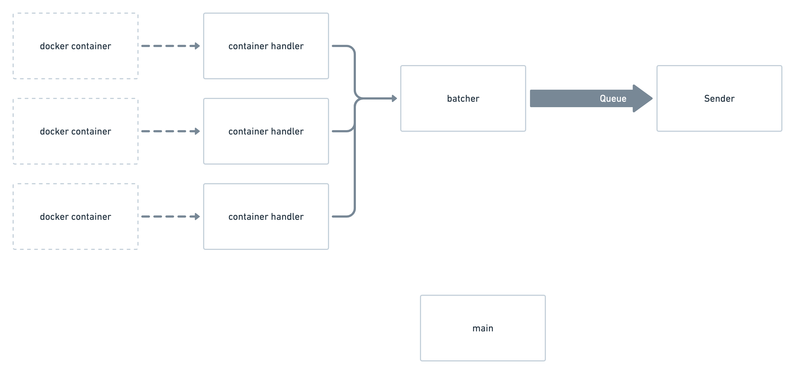

# fourwarder

Collect and send docker logs.

## Install

## Configure and run

### Filtering containers

### Filtering logs

### Formatting

### Sending

### Batching

### extra command line option

- batch size
- batch timeout
- fail

## Architecture

The application has the following threads running different components

- **main**: the main thread runs the docker event loop to listen for all the docker events
- **container handlers**: when a container is being monitored, a thread starts, listening to the incoming logs
- **batcher**: collects all the log lines, applies filtering and batches them before sending
- **sender**: sends the batches of log to the destination, managing failures and retries

